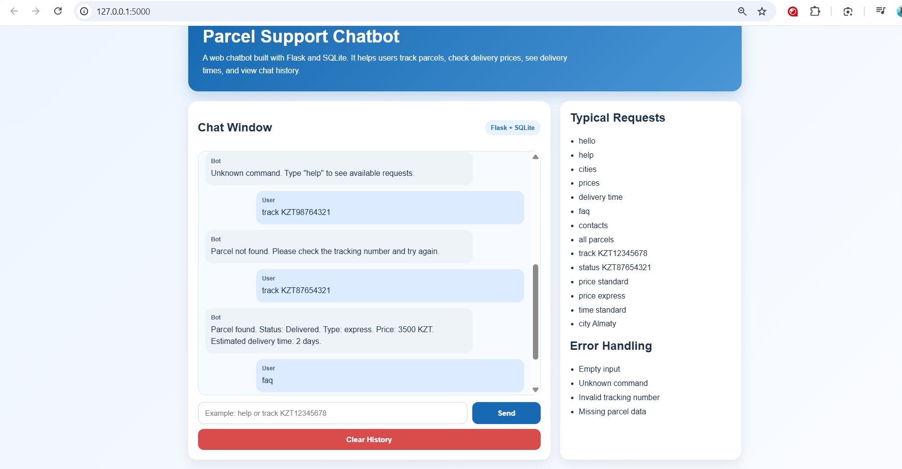
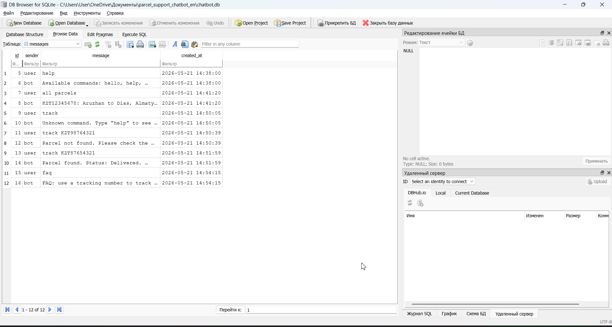

# Parcel Support Chatbot

## Project Title
Parcel Support Chatbot

## Project Description
Parcel Support Chatbot is an individual final project for the Python Programming course.
It is a web chatbot built with Python and Flask. The chatbot helps users track parcels,
check delivery prices, view delivery times, see available cities, and read frequently asked information.
The application stores chat history and parcel data in an SQLite database.

## Technologies Used
- Python 3
- Flask
- SQLite
- HTML5
- CSS3
- Object-Oriented Programming

## Installation Guide
1. Download or extract the project.
2. Open a terminal in the project folder.
3. Install dependencies:

```bash
pip install -r requirements.txt
```

## Run Guide
1. Start the application:

```bash
python app.py
```

2. Open the browser and go to:

```text
http://127.0.0.1:5000
```

## Typical Chatbot Requests
- hello
- help
- cities
- prices
- delivery time
- faq
- contacts
- all parcels
- track KZT12345678
- status KZT87654321
- price standard
- price express
- time standard
- time express
- city Almaty

## Error Handling
The chatbot handles:
- empty input;
- unknown commands;
- invalid tracking numbers;
- missing parcel data.

## Project Structure
```text
parcel_support_chatbot_en/
├── app.py
├── requirements.txt
├── README.md
├── presentation_outline_en.md
├── defense_script_en.md
├── chatbot.db
├── templates/
│   └── index.html
├── static/
│   └── style.css
└── services/
    ├── bot_engine.py
    ├── database.py
    └── parcel_service.py
```

## Main Features
- Flask web interface
- route `/`
- HTML form
- POST request handling
- 10+ chatbot commands
- dialog support
- SQLite chat history
- parcel data storage
- OOP structure with inheritance and polymorphism

## Screenshots

### Chat interface


### SQLite database
